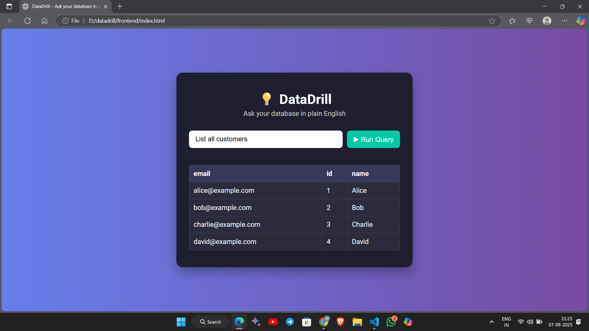

# DataDrill – Plain-Language Query Engine

DataDrill is a simple web application that lets you **query your database using plain English**. It converts natural language prompts into SQL, runs the query on a sample SQLite database, and displays the result in a web UI.

---

## ✨ Features

- 🔎 Converts plain English queries to SQL
- 🧠 Uses rule-based NLP mapping with spaCy
- 🗃️ Executes queries on a SQLite database
- 📊 Displays results as tables or charts
- 🖥️ Simple and clean web frontend

---

## 🏗️ Project Structure

datadrill/
│
├── backend/
│ ├── app.py # Flask API server
│ ├── query_engine.py # NLP → SQL mapping + SQL runner
│ ├── setup_db.py # Database schema and sample data
│ ├── db.sqlite # SQLite database (auto-generated)
│
├── frontend/
│ ├── index.html # UI form and display area
│ ├── style.css # Styling for frontend
│ ├── scripts.js # JavaScript to call backend API
│
├── venv/ # Python virtual environment
│
├── README.md # Project documentation
└── prompt_log.md # Logs of prompts and generated SQL

---

## ⚙️ Technologies Used

- **Backend:** Python, Flask, spaCy
- **Frontend:** HTML, CSS, JS (vanilla), Chart.js
- **Database:** SQLite

---

## 📦 Requirements

- Python 3.1
- Flask
- Flask-CORS

---

## 🚀 Setup Instructions

### 1. Clone the repo

```bash
git clone https://github.com/yourusername/datadrill.git
cd datadrill
```

### 2. Create and activate virtual environment

python -m venv venv
venv\Scripts\activate # On Windows

### 3. Install dependencies

pip install flask spacy
python -m spacy download en_core_web_sm

### 4. Initialize the database

cd backend
python init_db.py
cd ..

### 5. Run the backend server

python backend/app.py

Server will run at: http://127.0.0.1:5000

### 6. Open the frontend

start frontend\index.html # Or open manually in browser

## 💡 Example Prompts

Show me top customers
List all customers
Total customers
Total spent by each customer
Show all invoices
Top customer in Mumbai

## 🧪 Testing

You can test the /query API manually using:

Invoke-RestMethod -Uri "http://127.0.0.1:5000/query"  
-`Method POST`
-ContentType "application/json" `
-Body '{"text": "Show me top customers"}'

## 📂 Database Schema

# customers

customer_id INTEGER PRIMARY KEY,
name TEXT,
city TEXT

# invoices

invoice_id INTEGER PRIMARY KEY,
customer_id INTEGER,
amount REAL

## 📸 Screenshots



